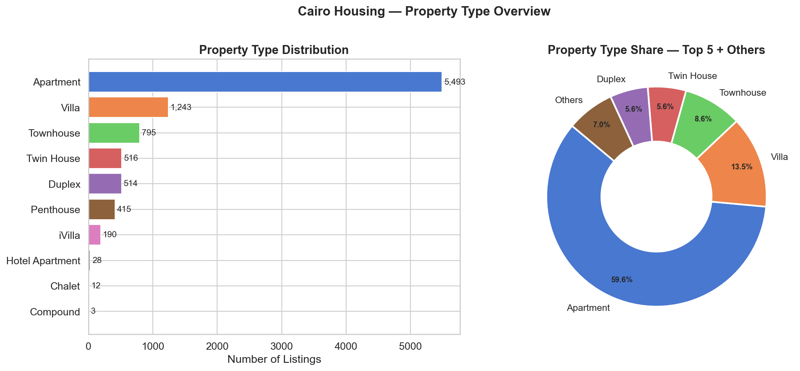
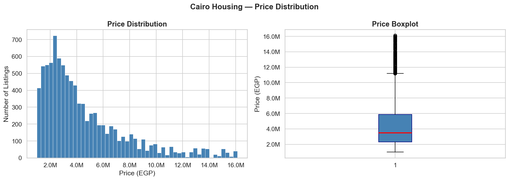
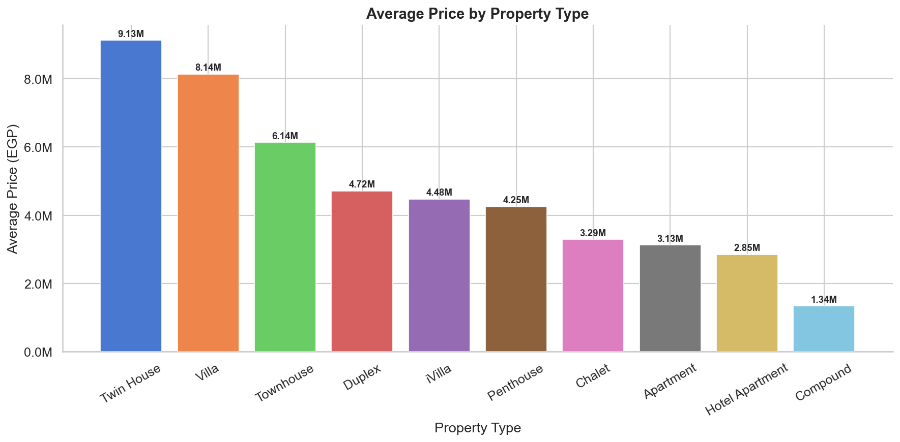
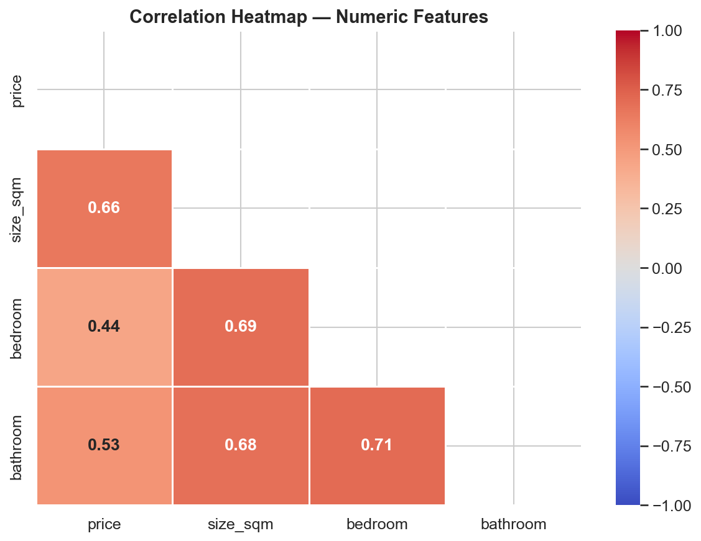
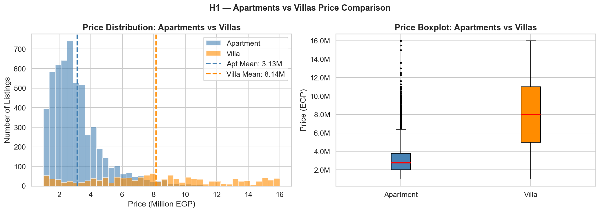
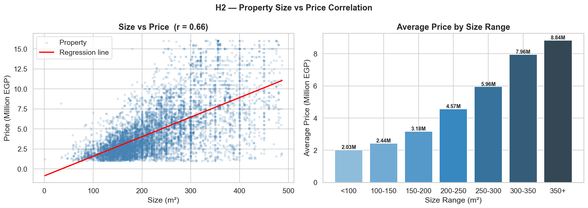
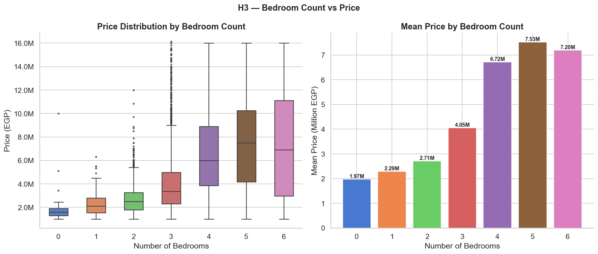

<div align="center">


</div>

<div align="center">


</div>

---

## 📌 Overview

This project presents a **full end-to-end data analysis** of Cairo's residential real estate market using a real-world dataset of over 11,000 property listings scraped from an active Egyptian marketplace.

The analysis follows the complete data science pipeline — from raw data preprocessing through exploratory analysis to formal statistical hypothesis testing — answering the central question:

> *"What are the key factors that significantly influence residential property prices in Cairo, Egypt?"*

This was submitted as the **Final Project for C-DE211: Data Analysis** at the Egypt University of Informatics (Spring 2026).

---

## 📊 Dataset

| Attribute | Details |
|---|---|
| **Source** | [Egypt Cairo Housing Prices — Kaggle](https://www.kaggle.com/datasets/iyadelwy/egypt-housing-prices) |
| **Original Records** | 11,418 property listings |
| **After Cleaning** | 9,209 records |
| **Features** | 7 columns |
| **Geographic Scope** | Cairo, Egypt (100% Cairo-based) |
| **Missing Values** | None |

### Features

| Column | Type | Description |
|---|---|---|
| `type` | Categorical | Property type (Apartment, Villa, Duplex, Townhouse, Penthouse, Twin House...) |
| `title` | Text | Listing title from the marketplace |
| `location` | Categorical | District and area within Cairo |
| `bedroom` | Ordinal | Number of bedrooms (0=Studio to 8) |
| `bathroom` | Integer | Number of bathrooms |
| `size_sqm` | Numeric | Property area in square meters |
| `price` | Numeric | Listing price in Egyptian Pounds (EGP) — target variable |

---

## 🔬 Research Hypotheses & Results

All three hypotheses were tested at **significance level α = 0.05**.

### H1 — Property Type vs. Price (Independent T-Test)

> **H₀:** No significant price difference between Villas and Apartments.  
> **H₁:** Villas are significantly more expensive than Apartments.

| Metric | Value |
|---|---|
| Apartments Mean | 3.13M EGP (n = 5,493) |
| Villas Mean | 8.14M EGP (n = 1,243) |
| Mean Difference | **5.01M EGP** |
| T-Statistic | **41.49** |
| P-Value | **< 0.000001** |
| Decision | ✅ **Reject H₀** |

**Conclusion:** Villas are significantly more expensive than Apartments in Cairo. The T-statistic of 41.49 indicates the two groups are separated by 41 standard errors — an exceptionally large effect size.

---

### H2 — Property Size vs. Price (Pearson Correlation)

> **H₀:** No significant correlation between property size (m²) and price.  
> **H₁:** A significant positive correlation exists between size and price.

| Metric | Value |
|---|---|
| Pearson r | **0.66** |
| Coefficient of Determination (r²) | **0.43** |
| Correlation Strength | Moderate-to-Strong Positive |
| P-Value | **< 0.000001** |
| Price Range | 2.03M (<100m²) → 8.84M EGP (350+m²) |
| Decision | ✅ **Reject H₀** |

**Conclusion:** Property size is a statistically significant predictor of price. Size alone explains **43% of price variance** across all listings — a 4.4x price increase from smallest to largest properties.

---

### H3 — Bedroom Count vs. Price (One-Way ANOVA)

> **H₀:** No significant difference in price across different bedroom counts.  
> **H₁:** Bedroom count significantly affects property price.

| Bedrooms | N | Mean Price |
|---|---|---|
| 0 (Studio) | 35 | 1.97M EGP |
| 1 | 133 | 2.29M EGP |
| 2 | 1,391 | 2.71M EGP |
| 3 | 5,210 | 4.05M EGP |
| 4 | 1,891 | 6.72M EGP |
| 5 | 461 | 7.53M EGP |
| 6 | 72 | 7.20M EGP |

| Metric | Value |
|---|---|
| F-Statistic | **437.43** |
| P-Value | **< 0.000001** |
| Groups Tested | 7 (min. 30 listings each) |
| Decision | ✅ **Reject H₀** |

**Conclusion:** Bedroom count has a highly significant effect on property price. The F-statistic of 437 means between-group variance is **437× larger** than within-group variance — a clear, consistent upward price trend.

---

## 📈 Key Visualizations

<table>
  <tr>
    <td align="center"><b>Property Type Distribution</b></td>
    <td align="center"><b>Price Distribution</b></td>
  </tr>
  <tr>
    <td></td>
    <td></td>
  </tr>
  <tr>
    <td align="center"><b>Average Price by Property Type</b></td>
    <td align="center"><b>Correlation Heatmap</b></td>
  </tr>
  <tr>
    <td></td>
    <td></td>
  </tr>
  <tr>
    <td align="center"><b>H1 — Apartments vs. Villas</b></td>
    <td align="center"><b>H2 — Size vs. Price Correlation</b></td>
  </tr>
  <tr>
    <td></td>
    <td></td>
  </tr>
  <tr>
    <td align="center" colspan="2"><b>H3 — Bedroom Count vs. Price (ANOVA)</b></td>
  </tr>
  <tr>
    <td colspan="2" align="center"></td>
  </tr>
</table>

---

## 🧹 Data Preprocessing Pipeline

```
Raw Dataset (11,418 rows)
        │
        ▼
Remove 308 duplicate rows
        │
        ▼
Convert price & size_sqm from string to numeric
        │
        ▼
Drop 402 listings with price = "Ask" (no real price)
        │
        ▼
Clean bedroom column (Studio → 0, remove malformed entries)
        │
        ▼
Remove outliers via IQR method (1.5 × IQR)
├── price: removed 896 outliers | valid range: 1M–16.25M EGP
└── size_sqm: removed 603 outliers | valid range: 1–487 m²
        │
        ▼
Clean Dataset: 9,209 rows | 0 missing values | all correct types
```

---

## 🛠️ Tech Stack

```python
# Core
import pandas as pd          # Data manipulation
import numpy as np           # Numerical operations

# Visualization
import matplotlib.pyplot as plt
import matplotlib.ticker as mticker
import seaborn as sns

# Statistical Testing
from scipy.stats import ttest_ind    # H1 — T-Test
from scipy.stats import pearsonr     # H2 — Pearson Correlation
from scipy.stats import f_oneway     # H3 — One-Way ANOVA
```

---

## 📁 Repository Structure

```
cairo-housing-market-analysis/
│
├── 📓 notebook/
│   └── Cairo_Housing_Analysis.ipynb     ← Full analysis notebook
│
├── 📄 report/
│   └── Cairo_Housing_Analysis_Report.docx  ← Detailed written report
│
├── 🎨 poster/
│   └── Cairo_Housing_Poster.html        ← Research poster
│
├── 📊 plots/
│   ├── plot_01_property_type.png
│   ├── plot_02_price_distribution.png
│   ├── plot_03_size_distribution.png
│   ├── plot_04_avg_price_by_type.png
│   ├── plot_05_price_boxplot_by_type.png
│   ├── plot_06_bedroom_counts.png
│   ├── plot_07_avg_price_by_bedroom.png
│   ├── plot_08_correlation_heatmap.png
│   ├── plot_09_h1_visualization.png
│   ├── plot_10_h2_correlation.png
│   └── plot_11_h3_visualization.png
│
├── 📋 contribution/
│   └── Contribution_Sheet.xlsx
│
└── 📘 README.md
```

---

## 💡 Key Findings Summary

| Finding | Detail |
|---|---|
| 🏠 Property type is the biggest price gap | Villas cost **2.6× more** than Apartments (5.01M EGP difference) |
| 📐 Size is the strongest continuous predictor | r = 0.66 — explains **43% of price variance** |
| 🛏️ More bedrooms = significantly higher price | Studio → 5BR: **1.97M to 7.53M EGP** |
| 📊 Apartments dominate the market | **59.6%** of all Cairo listings are Apartments |
| 📈 All tests significant at α = 0.05 | p < 0.000001 across all 3 hypotheses |

---

## 🎓 Academic Context

| | |
|---|---|
| **Course** | C-DE211: Data Analysis |
| **Project** | Project 3 — Final Data Analysis Project |
| **Institution** | Egypt University of Informatics |
| **Faculty** | Faculty of Computing & Information Sciences |
| **Semester** | Spring 2026 |

---

## 👤 Author

**Eyad** — Computer Science Student  
Egypt University of Informatics  

---

<div align="center">


</div>
